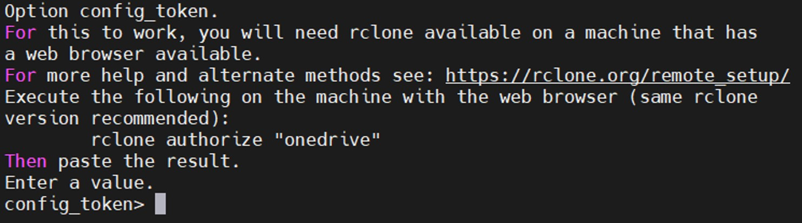
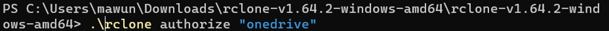

# Backing up Vaultwarden Data

### Table of Contents

[Introduction](#introduction)

[Configuring Rclone](#configuring-rclone)

[Sections](#sections)

## Introduction

An important thing for a password manager to do is backup its data. To do this, I used a Docker image named 'Vaultwarden Backup' created by **ttionya** from [this link](https://github.com/ttionya/vaultwarden-backup). This Docker image uses Rclone to save your Vaultwarden server's data to a cloud storage service of your choice, and has the ability to create automatic backups based on a cron schedule, manual backups, and the ability to restore backups to return your Vaultwarden server's data to a specific state.

This section outlines the steps I took to add backup and restoration functionalities to my Vaultwarden server.

## Configuring Rclone

For this Vaultwarden backup Docker image to work, you firstly need to configure Rclone. To do this, enter the following into your Raspberry Pi's terminal:

```shell
docker run --rm -it \
  --mount type=volume,source=vaultwarden-rclone-data,target=/config/ \
  ttionya/vaultwarden-backup:latest \
  rclone config
```

You will be given a prompt to make a new remote. Type ‘n’ to create a new configuration:

<p align="center">

</p>

Name the remote ‘BitwardenBackup’:

<p align="center">

</p>

Then choose the number of the storage of your choice, type it in and press ‘Enter’. I chose OneDrive so I typed in ‘31’:

<p align="center">

</p>

<p align="center">

</p>

<p align="center">

</p>

From here onwards, this guide will give instructions for adding a Onedrive remote, to see how to add other remotes, see [Rclone](https://rclone.org/#providers) to find your cloud storage provider.

Skip the client ID and client secret options. Then for the region option, select '1' unless you are using one of the other 3 regions:

<p align="center">

</p>

Skip 'edit advanced config'. Then for the remote authentication, press Enter if you are accessing your Raspberry Pi directly, otherwise type in ‘n’ and press Enter if you are accessing it via SSH. I accessed my Raspberry Pi via SSH, so I chose 'n':

<p align="center">

</p>

Pressing No will give you a prompt telling you to have Rclone available on your PC to generate a config token:

<p align="center">

</p>

For this method, install Rclone on your PC (see [Rclone downloads](https://rclone.org/downloads/)).

If you are using Windows, go to the folder where the ‘rclone.exe’ file is and right click > Open in Terminal (or Powershell, or CMD). Then type:

<p align="center">

</p>

Your PC will then open up your default browser asking you to authorise Rclone. Sign in with the Microsoft account associated with your desired Onedrive account.

Once you sign in, click Accept for Rclone permissions.

<p align="center">

</p>

When the authorisation is complete, go back to the terminal. You will be given the config token:

<p align="center">

</p>

Copy the entire config token from the end of the arrow after 'machine' to the beginning of the arrow before 'End paste' and paste it into the Raspberry Pi terminal:

<p align="center">

</p>

If successful, you will see options for the type of connection. I use OneDrive Personal, so I selected 1:

<p align="center">

</p>

Then select your Drive ID:

<p align="center">

</p>

Press Enter to confirm drive:

<p align="center">

</p>

The configuration will then be complete. Press Enter to keep the remote for Vaultwarden.

<p align="center">

</p>

Then select 'q' to exit the Rclone config menu.

<p align="center">

</p>

## Sections

#### Home Page: [Vaultwarden on Raspberry Pi](../../)

#### Previous Section: [Configuring Vaultwarden](../vaultwarden_config/)
