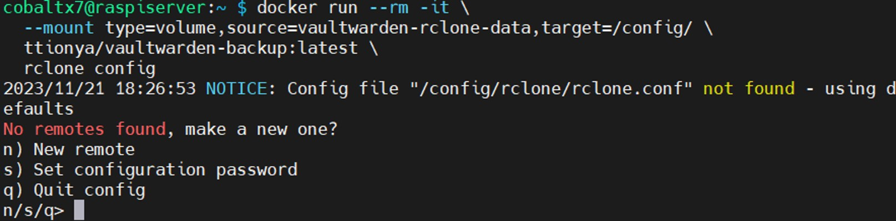

# Backing up Vaultwarden Data

### Table of Contents

[Introduction](#introduction)

[Configuring Rclone](#configuring-rclone)

[Automatically Backing up Vaultwarden](#automatically-backing-up-vaultwarden)

[Sections](#sections)

## Introduction

An important thing for a password manager to do is backup its data. To do this, I used a Docker image named 'Vaultwarden Backup' created by **ttionya** from [this link](https://github.com/ttionya/vaultwarden-backup). This Docker image uses Rclone to save your Vaultwarden server's data to a cloud storage service of your choice, and has the ability to create automatic backups based on a cron schedule, manual backups, and the ability to restore backups to return your Vaultwarden server's data to a specific state.

This section outlines the steps I took to add backup and restoration functionalities to my Vaultwarden server.

## Configuring Rclone

For this Vaultwarden backup Docker image to work, you firstly need to configure Rclone. To do this, enter the following into your Raspberry Pi's terminal:

```shell
docker run --rm -it \
  --mount type=volume,source=vaultwarden-rclone-data,target=/config/ \
  ttionya/vaultwarden-backup:latest \
  rclone config
```

You will be given a prompt to make a new remote. Type ‘n’ to create a new configuration:

<p align="center">

</p>

Name the remote ‘BitwardenBackup’:

<p align="center">

</p>

Then choose the number of the storage of your choice, type it in and press ‘Enter’. I chose OneDrive so I typed in ‘31’:

<p align="center">

</p>

<p align="center">

</p>

<p align="center">

</p>

From here onwards, this guide will give instructions for adding a Onedrive remote, to see how to add other remotes, see [Rclone](https://rclone.org/#providers) to find your cloud storage provider.

Skip the client ID and client secret options. Then for the region option, select '1' unless you are using one of the other 3 regions:

<p align="center">

</p>

Skip 'edit advanced config'. Then for the remote authentication, press Enter if you are accessing your Raspberry Pi directly, otherwise type in ‘n’ and press Enter if you are accessing it via SSH. I accessed my Raspberry Pi via SSH, so I chose 'n':

<p align="center">

</p>

Pressing No will give you a prompt telling you to have Rclone available on your PC to generate a config token:

<p align="center">

</p>

For this method, install Rclone on your PC (see [Rclone downloads](https://rclone.org/downloads/)).

If you are using Windows, go to the folder where the ‘rclone.exe’ file is and right click > Open in Terminal (or Powershell, or CMD). Then type:

```powershell
.\rclone authorize "onedrive"
```

<p align="center">

</p>

Your PC will then open up your default browser asking you to authorise Rclone. Sign in with the Microsoft account associated with your desired Onedrive account.

Once you sign in, click Accept for Rclone permissions.

<p align="center">

</p>

When the authorisation is complete, go back to the terminal. You will be given the config token:

<p align="center">

</p>

Copy the entire config token from the end of the arrow after 'machine' to the beginning of the arrow before 'End paste' and paste it into the Raspberry Pi terminal:

<p align="center">

</p>

If successful, you will see options for the type of connection. I use OneDrive Personal, so I selected 1:

<p align="center">

</p>

Then select your Drive ID:

<p align="center">

</p>

Press Enter to confirm drive:

<p align="center">

</p>

The configuration will then be complete. Press Enter to keep the remote for Vaultwarden.

<p align="center">

</p>

Then select 'q' to exit the Rclone config menu.

<p align="center">

</p>

> NOTE - You can confirm that your remote has been made by entering the following in the Raspberry Pi terminal:
>
> ```shell
> docker run --rm -it \
>   --mount type=volume,source=vaultwarden-rclone-data,target=/config/ \
>   ttionya/vaultwarden-backup:latest \
>   rclone config show
> ```
>
> The output will show the details of the remote you made for Vaultwarden

## Automatically Backing up Vaultwarden

After configuring the remote connection to your cloud storage account, edit your Vaultwarden Docker Compose file and add the Vaultwarden backup container:

```yaml
backup:
  container_name: vaultwarden-backup
  image: ttionya/vaultwarden-backup:latest
  restart: unless-stopped
  env_file:
    - backup.env
  volumes:
    - vaultwarden-data:/bitwarden/data/
    - vaultwarden-rclone-data:/config/
```

Then add the following volume to the 'volumes' attribute at the bottom of the file:

```yaml
vaultwarden-rclone-data:
  external: true
  name: vaultwarden-rclone-data
```

Then save and exit, and create a backup environment file for the backup container's environment variables:

```shell
nano backup.env
```

And add the following environment variables:

```bash
# Name of Rclone Remote created in Rclone config
RCLONE_REMOTE_NAME='BitwardenBackup'
# Directory of Vaultwarden Backup in cloud storage
RCLONE_REMOTE_DIR='/BitwardenBackup/'
RCLONE_GLOBAL_FLAG=''
# Schedule for backing up data. By default every 5th minute of the hour
CRON='5 * * * *'
# Put all backup files into a compressed file
ZIP_ENABLE='TRUE'
# Password required to open ZIP file
ZIP_PASSWORD='YourPassword'
ZIP_TYPE='zip'
# Number of days the backup files will be kept in cloud storage
BACKUP_KEEP_DAYS=0
# Backup ZIP file will have the date and time appended to the end of its name
BACKUP_FILE_SUFFIX='%Y-%m-%d_%H-%M'
# Configure for cron monitoring
PING_URL=''
# Enable sending emails to your email to confirm backups taking place
MAIL_SMTP_ENABLE='TRUE'
# Adding SMTP environment variables for sending mail. Setup in similar way to Vaultwarden’s SMTP settings
MAIL_SMTP_VARIABLES='-S smtp-use-starttls -S smtp=your.smtp.server -S smtp-auth=login -S smtp-auth-user=YourEmailAddress@email.com -S smtp-auth-password=YourAppPassword -S from=YourEmailAddress@email.com'
# Your email address
MAIL_TO='YourEmailAddress@email.com'
# Send email when there is either a success or failure in backing up data (good for debugging)
MAIL_WHEN_SUCCESS='TRUE'
MAIL_WHEN_FAILURE='TRUE'
# Your timezone
TIMEZONE=UTC
```

> IMPORTANT - If you want email alerts to know if the backups are successful or unsuccessful, change the ‘smtp’, ‘smtp-auth-user’, and ‘from’ SMTP environment variables, and create a new app password for your email account. If you are using Gmail, repeat the same steps for creating an app password for sending mail via Gmail’s SMTP server as covered in the '[Configuring Vaultwarden](../vaultwarden_config/README.md/#adding-smtp-functionality-to-vaultwarden)’ section. For this particular setup, omit the whitespaces in the Google App password for the mail to send successfully.

After setting up the Docker Compose file, run Vaultwarden and the backup containers:

```shell
docker compose up -d
```

Now your Vaultwarden data will backup automatically to your cloud storage system. To confirm this, check your cloud storage to see if the backup folder has been created. As a test, I set the cron schedule to ‘\* \* \* \* \*’ to create a backup every minute.

Here is the updated Vaultwarden backup folder in OneDrive:

<p align="center">

</p>

Here is the email sent by the Docker Vaultwarden backup container:

<p align="center">

</p>

Here is what a backup zip file looks like in the file explorer:

<p align="center">

</p>

As you can see, the files are password protected by the 'ZIP_PASSWORD' environment variable for the Vaultwarden backup container. When extracting the backup zip file, enter the password you provided for the environment variable:

<p align="center">

</p>

## Sections

#### Home Page: [Vaultwarden on Raspberry Pi](../../)

#### Previous Section: [Configuring Vaultwarden](../vaultwarden_config/)
