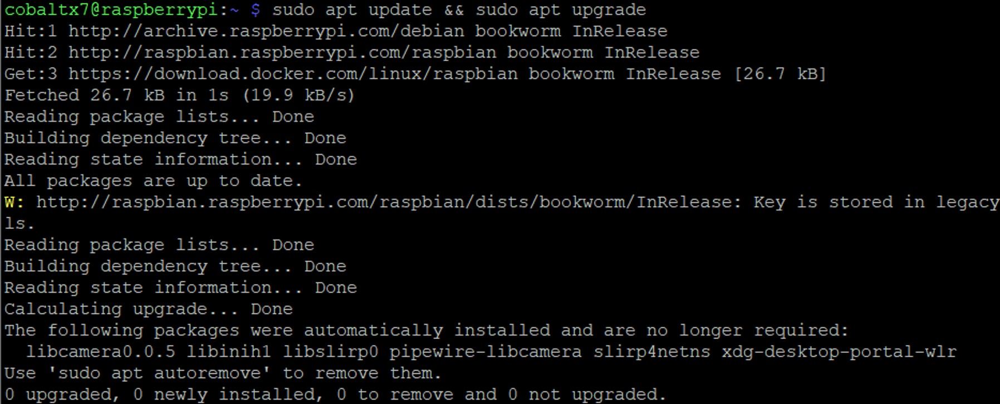

# Setting up Docker on the Raspberry Pi

### Table of Contents

[Introduction](#introduction)

[Installing Docker](#installing-docker)

[Sections](#sections)

# Introduction

For Bitwarden to be hosted on the Raspberry Pi, I needed to install Docker onto it. Docker is an application that virtualises application environments by creating images which describe the runtime environment, dependencies, and operating system that an application will run on. Then Docker runs an instance of an image called a container, which can run the application on any computer with Docker installed. This makes it easier to develop apps and then share them to other machines with different operating systems or different distributions of an operating system without issues with the runtime environment.

This section outlines the steps I took to setup Docker onto my Raspberry Pi.

# Installing Docker

To install Docker, first check if Docker is on your Raspberry Pi:

```shell
which docker
```

<p align="center">

</p>

If you get the directory for the docker binary, then you can skip this step.

Otherwise, update the Raspberry Pi to install the most advanced software version:

```shell
sudo apt update && sudo apt upgrade -y
```

<p align="center">

</p>

Then to install Docker, you can use 4 different methods (see [Docker Install on Raspberry Pi](https://docs.docker.com/engine/install/raspberry-pi-os/) for guide). I used the Docker apt repository method.

Firstly, Create a BASH script:

```shell
nano docker-apt.sh
```

Then copy this script from the Docker website into the file:

```bash
# Add Docker's official GPG key:
sudo apt-get update
sudo apt-get install ca-certificates curl gnupg
sudo install -m 0755 -d /etc/apt/keyrings
curl -fsSL https://download.docker.com/linux/raspbian/gpg | sudo gpg --dearmor -o /etc/apt/keyrings/docker.gpg
sudo chmod a+r /etc/apt/keyrings/docker.gpg

# Set up Docker's APT repository:
echo \
  "deb [arch=$(dpkg --print-architecture) signed-by=/etc/apt/keyrings/docker.gpg] https://download.docker.com/linux/raspbian \
  $(. /etc/os-release && echo "$VERSION_CODENAME") stable" | \
  sudo tee /etc/apt/sources.list.d/docker.list > /dev/null
sudo apt-get update
```

Save the file and add executable permissions for the script:

```shell
sudo chmod +x docker-apt.sh
```

Then run the script with:

```shell
./docker-apt.sh
```

Once the script has finished, Docker will be available to be installed with the ‘apt’ package manager.

Then install Docker:

```shell
sudo apt-get install docker-ce docker-ce-cli containerd.io docker-buildx-plugin docker-compose-plugin
```

After the installation, check to see if Docker installed correctly:

```shell
which docker
```

<p align="center">

</p>

It should print `usr/bin/docker`. Now when you try to use a Docker command without the ‘sudo’ keyword, you will be denied permission to execute the command.

<p align="center">

</p>

To grant your non-root Raspberry Pi user permission, enter:

```shell
# Replace '<username>' with your username
sudo usermod -aG docker <username>
```

Then log out and log back in to see the changes in effect. If you’re using SSH, simply type ‘exit’ to sign out and then reconnect to your Raspberry Pi.

<p align="center">

</p>

Now that Docker is installed correctly, you can now download the BitWarden image for our Raspberry Pi.

## Sections

#### Previous Section: [Setting up SSH](../ssh_setup/)

#### Next Section: [Setting up HTTPS for Vaultwarden Server](../https_setup/)
