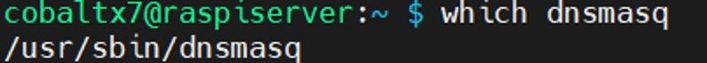

# Setting up HTTPS for Vaultwarden Server

### Table of Contents

[Introduction](#introduction)

[Acquiring a Public Domain](#acquiring-a-public-domain)

[Setting up Cloudflare DNS for the Public Domain](#setting-up-cloudflare-dns-for-the-public-domain)

[Setting up a Private DNS Server with dnsmasq](#setting-up-a-private-dns-server-with-dnsmasq)

[Creating HTTPS Domain Names with Nginx Proxy Manager and Cloudflare DNS](#creating-https-domain-names-with-nginx-proxy-manager-and-cloudflare-dns)

## Introduction

In order for Vaultwarden to work, it must be accessed via HTTPS, which requires these 4 main steps:

1. Acquiring a public domain
2. Setting up Cloudflare DNS for the public domain
3. Setting up a private DNS server with dnsmasq
4. Creating HTTPS domain names with Nginx Proxy Manager and Cloudflare DNS

## Acquiring a Public Domain

> NOTE - If you already have a public domain, then skip this step.

Buying a domain is recommended over using a free domain such as DuckDNS, as the domain ownership is tied to you only. I used Namecheap to buy a '.com' domain, so I will give a guide for buying a Namecheap domain.

On your PC, visit [Namecheap](https://www.namecheap.com/) and enter your desired domain name. I recommend using ‘.com’ as it is cheaper.

<p align="center">

</p>

If the domain name is available, click ‘Add to cart’ and click ‘Checkout’.

Then you will be visited with the checkout page.

<p align="center">

</p>

Make sure to enable ‘Domain Privacy’ to hide your information in the public Whois database. This database stores the information of a domain registrar.

You can optionally choose to auto-renew your domain registration and your domain privacy, of which the latter is free forever.

Create an account and enter your personal details, then your payment details. Then after confirming your order, you will have a public domain name for your own use.

## Setting up Cloudflare DNS for the Public Domain

For the DNS server, I used Cloudflare DNS as it is free, easy to setup, and is reputable. To start, create a free Cloudflare account on [Cloudflare](https://www.cloudflare.com).

Once you have signed up, see [this guide](https://www.namecheap.com/support/knowledgebase/article.aspx/9607/2210/how-to-set-up-dns-records-for-your-domain-in-cloudflare-account/), which will show you how to set the authoritative DNS servers for your Namecheap domain to Cloudflare DNS servers. If you didn’t buy a domain with Namecheap, simply search the domain registrar service and Cloudflare DNS, and you should find a guide telling you how to setup the authoritative DNS servers.

Once the Cloudflare DNS is set up, go to the records of your DNS server and add an A record. Give this a subdomain name of preferrably ‘home’, then add the private IP address of your Raspberry Pi in your LAN.

<p align="center">

</p>

Then create a CNAME record to point the domains of all of your private services (such as Nginx Proxy Manager and Vaultwarden) to your Raspberry Pi’s IP address.

<p align="center">

</p>

> NOTE - To add further security to your domain, add DNSSEC to protect against DNS spoofing. This means that when a client computer makes a request is made to a DNS server to resolve a domain name, the response is authenticated using public key cryptography to ensure that the response given to the client originates from the correct source.
>
> To do this, see [this guide](https://developers.cloudflare.com/dns/dnssec/) for a guide on enabling DNSSEC for your domain name.

## Setting up a Private DNS Server with dnsmasq

For the private Vaultwarden domain to resolve to the Vaultwarden web server that you will host on your Raspberry Pi, you need to create a private DNS server that can resolve private domain names. For this, I used dnsmasq as it is lightweight, and simple to setup for making a private DNS server.

On your Raspberry Pi, check if dnsmasq is installed:

```shell
which dnsmasq
```

<p align="center">

</p>

If it isn’t installed, firstly update and upgrade the Raspberry Pi, and then install dnsmasq:

```shell
sudo apt update && sudo apt upgrade -y
sudo apt install dnsmasq
```

Then go to /etc/dnsmasq.d/ and create a configuration file:

```shell
cd /etc/dnsmasq.d/
sudo nano dns_config.conf
```

In the text editor, enter the following into the file:

```conf
domain-needed
bogus-priv
no-resolv
server=primary.isp.dns.server
server=secondary.isp.dns.server
listen-address=::1,127.0.0.1,raspberry.pi.ip.address
```

Here is the meaning behind each line:

- domain-needed: Never forward A queries for plain domain names without dots or domain parts to upstream nameservers (e.g. the query for ‘mywebsite’ will not be forwarded past dnsmasq)
- bogus-priv: All reverse lookups for private IP address ranges e.g. 192.168.x.x will not be forwarded to upstream nameservers (e.g. the query ‘192.168.1.170’ will not be forwarded past dnsmasq)
- no-resolv: Don’t get upstream servers from /etc/resolv.conf file in Raspberry Pi
- server: Defines the upstream servers to use. Replace placeholders with the IPs of your ISP’s DNS servers
- listen-address: Defines which IP addresses to listen to when processing DNS queries. Replace the placeholder with your Raspberry Pi’s private IP address

Save the file, then start and enable the service, or restart the service if already started:

```shell
# Start and enable dnsmasq
sudo systemctl enable --now dnsmasq
# OR
# Restart dnsmasq
sudo systemctl restart dnsmasq
```

Check to see the status of dnsmasq:

```shell
sudo systemctl status dnsmasq
```

<p align="center">

</p>

To test to see if domains are resolving correctly use the 'nslookup' command:

```shell
nslookup www.google.com your.raspberry.pi.ip
```

<p align="center">

</p>

It should give a public IP address, which points to Google.

## Creating HTTPS Domain Names with Nginx Proxy Manager and Cloudflare DNS

For the Raspberry Pi to run multiple services and have each one be accessed with a domain name, it needs a reverse proxy. A reverse proxy is a part of a network that handles incoming connections coming from client devices outside the network to the servers within the network. Nginx Proxy Manager allows you to create unique domains for each service you run on your Raspberry Pi, for access via HTTP or HTTPS.

On your Raspberry Pi, create a directory to keep the Docker Compose files for Nginx Proxy Manager and Vaultwarden:

```shell
# Making home server directory
mkdir home_server
cd home_server
# Making Nginx Proxy Manager directory
mkdir npm
cd npm
```

In the npm directory, create a Docker Compose file:

```shell
nano docker-compose.yml
```

Enter the following code:

```yml
version: "3"
services:
  nginxproxymanager:
    container_name: nginx_proxy_manager
    image: "jc21/nginx-proxy-manager:latest"
    restart: unless-stopped
    ports:
      - "80:80"
      - "81:81"
      - "443:443"
    volumes:
      - data:/data
      - letsencrypt:/etc/letsencrypt
volumes:
  data:
  letsencrypt:
```

---

#### Previous Section: [Setting up Docker on the Raspberry Pi](../docker_setup/)

#### Next Section: [...]()
