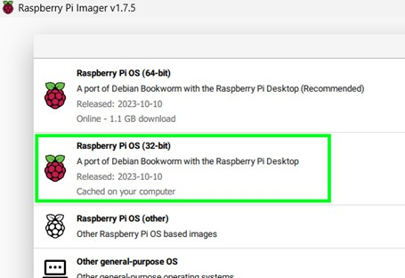

# Setting Up the Raspberry Pi

Setting up the Raspberry Pi is simple. Firstly, install the OS onto your Raspberry Pi’s microSD card with the Raspberry Pi Imager application (see [how to use Raspberry Pi Imager](https://www.youtube.com/watch?v=ntaXWS8Lk34) for guide). I chose Raspberry Pi OS (32-bit) for this project.

> NOTE - You can configure the hostname, username and password, and SSH from the imager application. To do this, after selecting the OS you want to use, a settings button will appear in the bottom right.

