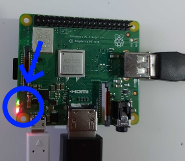
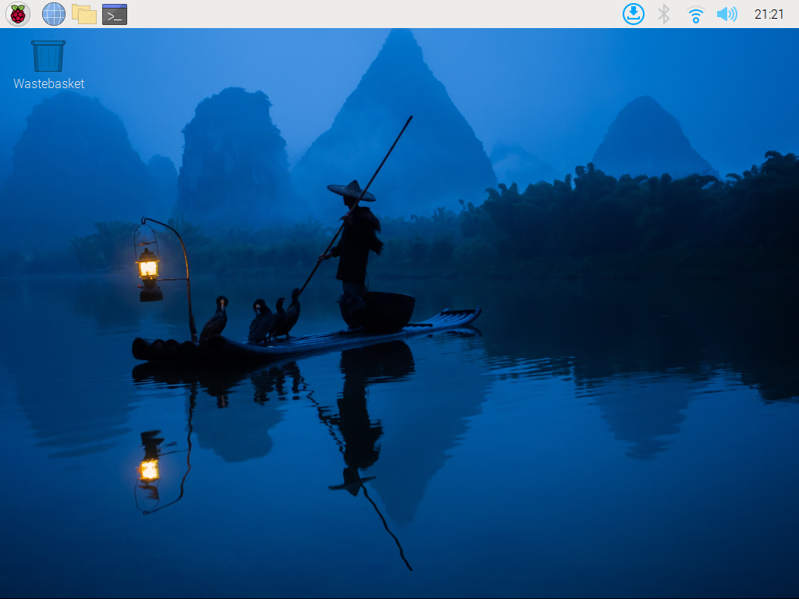
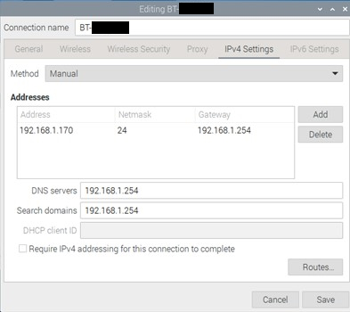

# Setting up the Raspberry Pi

### Table of Contents

[Introduction](#introduction)

[Setting up the Hardware and Operating System](#setting-up-the-hardware-and-operating-system)

[Setting up a Static IP Address](#setting-up-a-static-ip-address)

## Introduction

Before working on hosting Vaultwarden within your LAN, I needed to setup the Raspberry Pi to act as a server computer. This section outlines the steps I took to setup a Raspberry Pi, specifically a Raspberry Pi 3 Model A+.

## Setting up the Hardware and Operating System

Setting up the Raspberry Pi's operating system is simple. Firstly, install the OS onto your Raspberry Pi’s microSD card with the Raspberry Pi Imager application (see [how to use Raspberry Pi Imager](https://www.youtube.com/watch?v=ntaXWS8Lk34) for guide). I chose the Raspberry Pi OS (32-bit) (or **Raspbian**) for this project, which is a port of Debian Bookworm designed for Raspberry Pis.

You can configure the hostname, username and password, and SSH from the imager application. To do this, after selecting the OS you want to use, a settings button will appear in the bottom right.

After clicking on the button, the advanced settings will appear, where you can enable different features. I only configured the username and password for my project.

Once the OS is written onto the microSD card, eject the microSD card safely. It is very important to eject the microSD card safely, otherwise the data on it may be corrupted.

After ejecting the microSD card, setup the Raspberry Pi before giving it power.

> NOTE - The most important thing to do when setting up a Raspberry Pi for the first time is to insert the power cable last, and put the microSD and other cables in first.

> It is also recommended to buy a case for your Raspberry Pi for extra physical protection and cooling. There is a good case for the Raspberry Pi 3 Model A+ you can buy on Amazon via [this link.](https://www.amazon.co.uk/Raspberry-Aluminum-Ultra-Thin-Alloy-Heatsink/dp/B08BFB8QS6/ref=asc_df_B08BFB8QS6/?tag=googshopuk-21&linkCode=df0&hvadid=658810724323&hvpos=&hvnetw=g&hvrand=3659962211446783774&hvpone=&hvptwo=&hvqmt=&hvdev=c&hvdvcmdl=&hvlocint=&hvlocphy=9044952&hvtargid=pla-1363894499759&psc=1&gclid=CjwKCAjw7c2pBhAZEiwA88pOFzWT5GgPT_59DPp5gqEzLoQBbIBmA41JrAh2voncs7bLknlUxpmObBoCY-IQAvD_BwE)

Then insert the power supply, the Raspberry Pi should have both the red (power) and green (system activity) LEDs turn on.

Once the Raspberry Pi finishes loading, you will be met with a home screen like this on your Raspberry Pi's display.

## Setting up a Static IP Address

Making the IP address of your Raspberry Pi will make hosting services much easier as there won’t be a need to constantly change the IP address in configuration files or settings.

To do this on the Raspberry Pi 3A+:

- Click the WiFi Icon > Advanced Options > Edit Connections
- Click on the current WiFi connection
- Go to IPv4 settings, change the method to manual
- Add your desired static IP address to the table of addresses, make the subnet mask '/24' and change the gateway to the IP address of your router
- Make the DNS servers and search domains the IP address of your router

- Click ‘Save’ and restart your Raspberry Pi

---

#### Next Section: [Setting up SSH](../ssh_setup/)
