# Setting up SSH

### Table of Contents

[Introduction](#introduction)

[Initial SSH Setup](#initial-ssh-setup)

[Setting up SSH Public Key Authentication](#setting-up-ssh-public-key-authentication)

[Connecting to SSH via PuTTY](#connecting-to-ssh-via-putty)

[File sharing via SFTP using FileZilla](#file-sharing-via-sftp-using-filezilla)

## Introduction

A very useful feature that comes with all operating systems is Secure Shell (SSH), which is a network comunnication protocol that allows two computers to communicate with each other. With this, you can access the Raspberry Pi from your PC through the command line. Secure File Transfer Protocol (SFTP) is an extension of SSH, and is a network protocol for securely accessing and transferring files between two computers. This allows you to create and edit files on your PC, and then transfer them to your Raspberry Pi after completion.

Since I was going to do the majority of development via my PC, I ensured that SSH and SFTP were configured correctly and securely. This section outlines the steps I took to setup a secure SSH and SFTP connection between my PC and my Raspberry Pi server.

## Initial SSH Setup

By default, SSH comes with Raspbian, but to make sure, enter:

```shell
# Shows directory of ssh binary file
which ssh
```

If a directory doesn't appear, then SSH isn’t installed on the Raspberry Pi. To install SSH, enter the following commands one by one:

```shell
# Update and upgrade system
sudo apt update && sudo apt upgrade -y
# Install SSH server
sudo apt install openssh-server
# Validate install
which ssh
```

After confirming that SSH is installed, your Raspberry Pi needs some basic security.

Firstly, it is good practice to create a sudo user, so that you don't accidentally make fatal changes to your system while logged in as root. Check to see if there are any extra users:

```shell
# Returns name of custom users
getent passwd {1000..60000} | cut -d: -f1
```

If there is a result, then you can move on to the next step. If not, create an account by entering:

```bash
# Add user (replace '<username>')
useradd -m <username>
# Create a password for new user
passwd <username>
```

`passwd` prompts you to set the password for the new user. Then give the new user root priviledges:

```shell
# Add user to sudo group
usermod -aG sudo <username>
```

Once you have a sudo user available, make sure you're logged into the user account and go to the SSH server configuration directory:

```shell
cd /etc/ssh/sshd_config.d
```

Create a config file to add SSH configurations for added security. Make sure the file ends in `.conf`.

```shell
sudo nano custom_config.conf
```

The terminal will show Nano, the default Raspbian text editor, inside a newly created file. Add the following lines to the file:

```bash
# Change port from default port 22 to different number
Port 2222
# Onlly allow SSH connections from users logging in as your user in your LAN
AllowUsers username@192.168.0.0/16
# Don't allow users to directly log into root when establishing SSH connection
PermitRootLogin no
```

Save the file with <kbd>CTRL + O</kbd>, <kbd>ENTER</kbd> and exit the file with <kbd>CTRL + X</kbd>.

To make sure that the SSH server is configured correctly without any errors, check to see if the SSH service is active:

```shell
sudo systemctl status ssh
```

If so, the 'Active' line will say 'active (running)' in green.

<p align="center">

</p>

If it is active, restart the service:

```shell
sudo systemctl restart ssh
```

Otherwise start the SSH service:

```shell
sudo systemctl start ssh
```

Also make sure that the service is enabled, so that it runs on boot.

```shell
sudo systemctl enable ssh
```

Check to see if the service is running without any errors:

```shell
sudo systemctl status ssh
```

The 'Active' line should say 'active (running)' in green.

After confirming the SSH service is working, go to your PC and open PuTTY (see [this link](https://www.putty.org/) for download and installation). When you open PuTTY, you should be in the ‘Session’ category by default. In this tab, enter the IP address of the Raspberry Pi and the port number of the SSH connection. Also ensure that SSH is selected as the ‘Connection type’.

<p align="center">
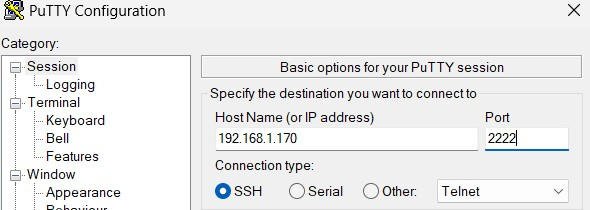
</p>

> NOTE – To find the private IPv4 address of your Raspberry Pi, enter ifconfig in the terminal, and you will find it under 'wlan0' (or 'eth0' if connected via Ethernet) as the 'inet' number

<p align="center">
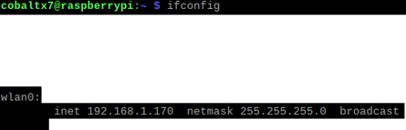
</p>

Name the configuration and then click ‘Save’ to save the configuration for your Raspberry Pi SSH connection.

<p align="center">
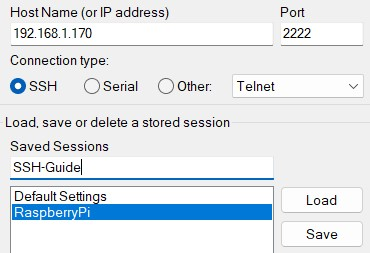
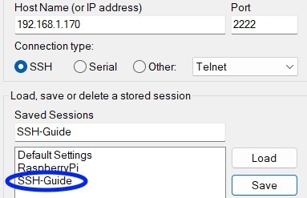
</p>

Test the SSH connection by clicking ‘Open’, then a terminal should appear asking to ‘login as:’. Enter the username of your user on the Raspberry Pi, and then the terminal will prompt you to enter a password. If entered correctly, you will now have access to your Raspberry Pi via your PC.

<p align="center">
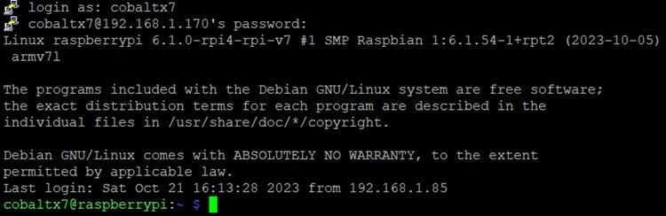
</p>

## Setting up SSH Public Key Authentication

It is recommended that you use public key authentication when using SSH to prevent unauthorised users from brute forcing into the Raspberry Pi. This step makes it so that only users that provide the private key that decrypts data encrypted by the public key within the Raspberry Pi are given access to the machine.

For this step, I used Windows, if you want to know how to do this as a Mac or Linux user, see [this video](https://www.youtube.com/watch?v=GxRu35fy-oY) for the full guide I used.

To setup keys, go to the terminal of your PC and type:

```powershell
# Change the -C argument to a suitable name for the key
ssh-keygen -t ed25519 -C "<keyname>"
```

<p align="center">
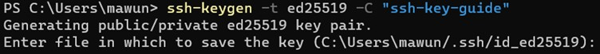
</p>

The terminal will prompt you to enter the directory and file name for the generated keys, enter the desired directory and file name you want to save the key as. I recommend saving it in the ‘.ssh’ directory in your home directory.

<p align="center">

</p>

Enter a passphrase for the keys you will generate. This will add an extra layer of security. After adding the passphrase, you will be shown the key fingerprint and the key's randomart image:

<p align="center">
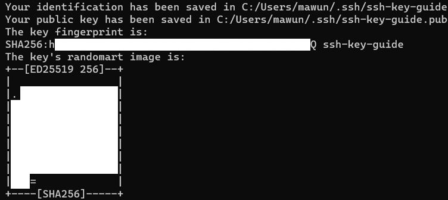
</p>

Then send the generated public key to the Raspberry Pi:

```powershell
# Change <key_name> to the name of your key, add -p flag if you changed your SSH port, and enter your Raspberry Pi's username and IP address
type $env:USERPROFILE\.ssh\<key_name>.pub | ssh -p <port_no> <pi_username>@<pi_ip_address> "cat >> .ssh/authorized_keys"
```

<p align="center">
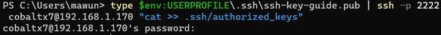
</p>

> NOTE - For Linux, 'ssh-copy-id' is a much simpler solution to use to copy your public key over to your Raspberry Pi:
>
> ```shell
> # Change <key_name> to the name of your key, add -p flag if you changed your SSH port, and enter your Raspberry Pi's username and IP address
> ssh-copy-id -i ~/.ssh/<key_name> -p <port_no> <pi_username>@<pi_ip_address>
> ```

After entering the password, the public key will be sent to the Raspberry Pi. You can find it in the `/home/$USER/.ssh/authorized_keys` file on your Raspberry Pi.

After confirming that the public key has been copied to your Raspberry Pi, update your SSH configuration file:

```shell
cd /etc/ssh/sshd_config.d
sudo nano custom_config.conf
```

Add the following lines to require users to login via public key authentication:

```bash
# Disable password authentication
PasswordAuthentication no
# Enable public key authentication
PubkeyAuthentication yes
```

Save the changes and restart the SSH server.

```shell
sudo systemctl restart ssh
```

## Connecting to SSH via PuTTY

Now that the public key has been added to the Raspberry Pi, for you to connect to it using PuTTY, you have to add the private key to the configuration.

Firstly, if you downloaded PuTTY correctly, you should have another application named ‘PuTTYgen’. Open it and click on the load button.

<p align="center">
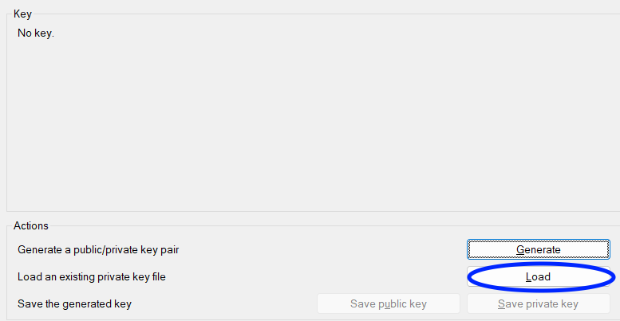
</p>

Change file types to ‘All Files’ and then go to the directory you generated the keys in. Select the private key (the one without the ‘.pub’ file extension)

<p align="center">
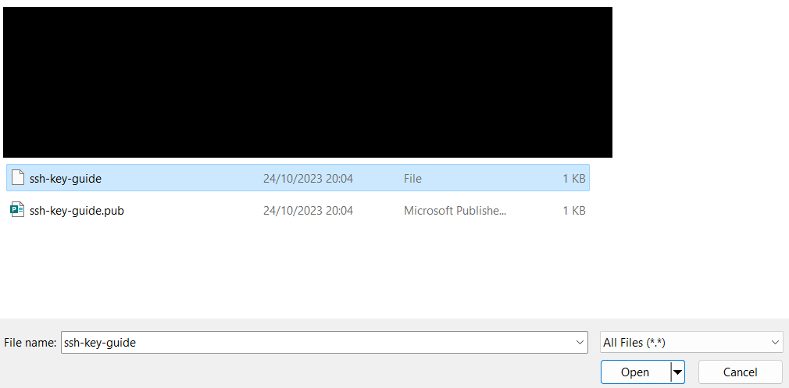
</p>

Enter the passphrase you gave the key and then it will load the private key.

<p align="center">
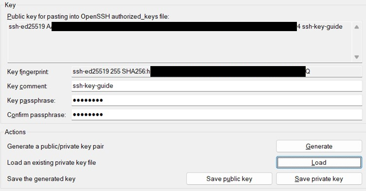
</p>

Then select ‘Save private key’ and then create a folder within your generated keys’ directory named ‘putty’ and save the private key PPK file in there.

<p align="center">

</p>

Now that the PPK file has been created, open PuTTY, go to the ‘Sessions’ category and load your previous configuration on PuTTY by selecting the configuration and clicking ‘Load’.

<p align="center">
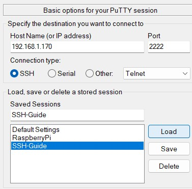
</p>

Then go to the Connection > SSH > Auth > Credentials tab.

<p align="center">
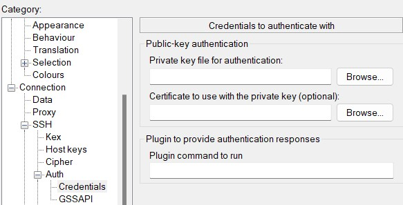
</p>

Click on ‘Browse’ next to ‘Private key file for authentication’ to load your private key PPK file. Save your configuration and then begin the SSH connection.

You will be given a prompt to ensure that you have connected to the correct SSH server. Click ‘Accept’ to trust the connection.

<p align="center">
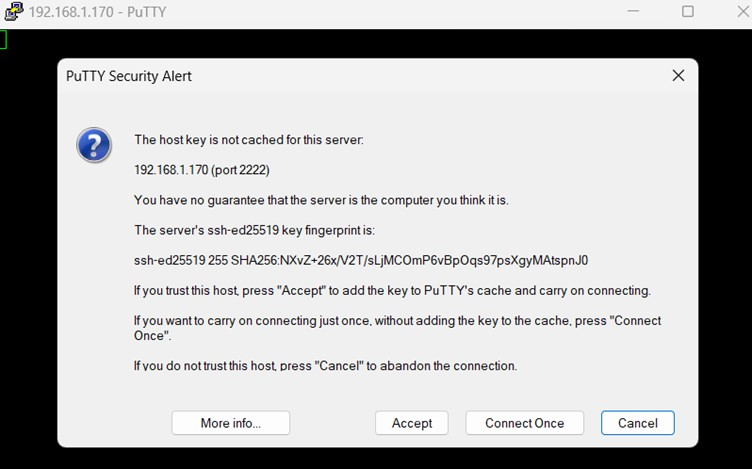
</p>

Then enter your Raspberry Pi user’s username and then the passphrase for your key. If each credential is entered correctly, you will now have access to the machine via SSH using PuTTY.

<p align="center">
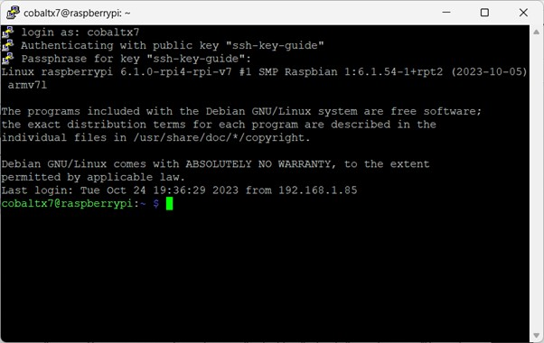
</p>

## File sharing via SFTP using FileZilla

SFTP is used to transfer files between computers connected via SSH. Since SFTP is a part of SSH, you can already use it after following the SSH setup. To make it easier to user SFTP, I decided to use FileZilla, an application that displays the directories of both SSH computers and makes file transfers very easy via dragging and dropping into each computer.

Firstly, download and install the Filezilla Client on your PC (see the [ FileZilla website](https://filezilla-project.org/) for the download and installation) and open it. Click on the site manager icon on the far left of the tab bar.

<p align="center">
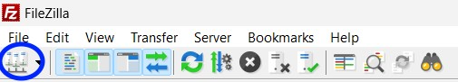
</p>

Then in the site manager click ‘New site’ to create a new SSH connection.

<p align="center">
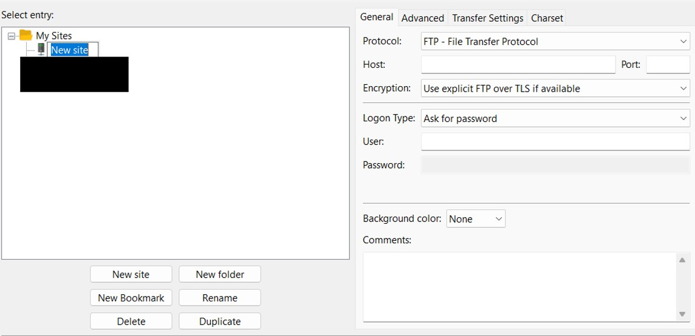
</p>

Change the protocol to SFTP, enter your IP address in the ‘Host’ field and port in the ‘Port’ field. Then change the logon type to ‘Key file’, enter the Raspberry Pi user’s username in the ‘User’ field, and then locate the private key PPK file for the ‘key file’ field.

<p align="center">
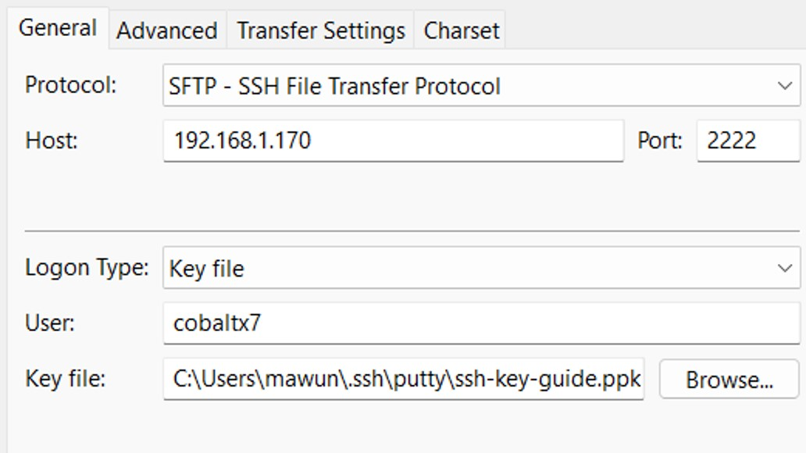
</p>

Click on ‘Connect’ to begin the SSH connection. You will then be prompted to enter the passphrase for the private key. Enter the private key and click ‘OK’ to resume the SSH connection.

<p align="center">
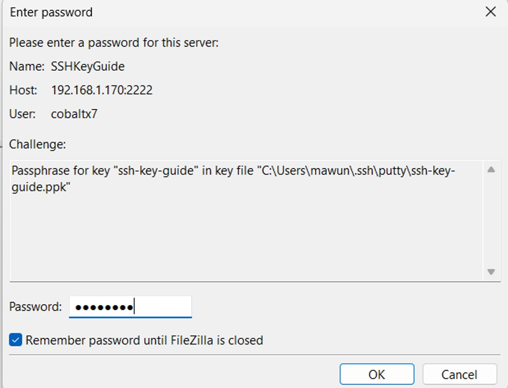
</p>

Now you will see your PC’s directories on the left, and the Raspberry Pi’s directories on the right.

<p align="center">
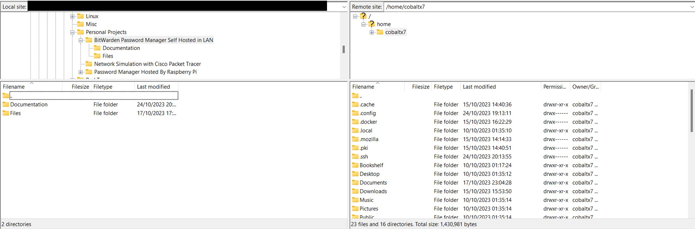
</p>

To transfer files, simply hold left click over the file, and then drag it into the folder you desire in the opposite computer’s directories.

---

#### Previous Section: [Setting up the Raspberry Pi](../raspberry_pi_setup/)

#### Next Section: [Setting up Docker on the Raspberry Pi](../docker_setup/)
