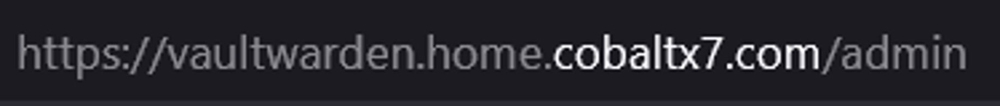
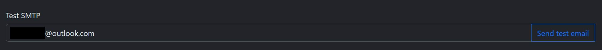

# Configuring Vaultwarden

### Table of Contents

[Introduction](#introduction)

[Creating Admin Password](#creating-admin-password)

[Adding SMTP functionality to Vaultwarden](#adding-smtp-functionality-to-vaultwarden)

[Sections](#sections)

## Introduction

To make the Vaultwarden Docker container to allow emails to be sent to users and to allow more security for the application, you need to add multiple enviroment variables to the Docker Compose file.

This section outlines the steps I took to configure my Vaultwarden server on my Raspberry Pi.

## Creating Admin Password

Go to your Vaultwarden Docker Compose file directory and start the container:

```shell
# Go to directory
cd vaultwarden
# Start container
docker compose up -d
```

Firstly, you need to generate an admin token for Vaultwarden. To generate the token, you need to access the Vaultwarden container’s terminal. To do this, enter the terminal of the Docker container:

```shell
docker exec -it vaultwarden bash
```

<p align="center">

</p>

You will now have access to the container’s internal files and directories.

<p align="center">

</p>

Enter the following to create a hash for the admin token:

```shell
./vaultwarden hash
```

<p align="center">

</p>

Enter a strong password to use as the admin login. The script will ask you to re-enter the password after entering the first password.

The script will then create a hash for your password:

<p align="center">

</p>

Copy the admin token and make sure to have it when editing the Vaultwarden Docker Compose file.

Exit the container’s terminal:

```shell
exit
```

Before adding the admin token as an environment variable, it is good practice to add environment variables in a separate file, so that sensitive information isn’t hard coded into the Docker Compose file and modifications to environment variables is much easier.

Create a .env file for Vaultwarden:

```shell
nano vaultwarden.env
```

Add the admin token environment variable:

```bash
# Hash of admin password to use to login as admin
ADMIN_TOKEN=yourAdminToken
```

Remove the single quotes surrounding your admin token and add an extra dollar sign after each dollar sign. Your admin token environment variable should look like this:

<p align="center">

</p>

Save and exit, then edit the Docker Compose file:

```shell
nano docker-compose.yml
```

Add the following to the file after the ‘ports’ attribute:

```yaml
env_file:
  - vaultwarden.env
```

Save and exit the text editor and then restart the Vaultwarden container:

```shell
docker compose down
docker compose up -d
```

In your web browser, enter the domain name of your Vaultwarden server, and append ‘/admin’ to the end to access the admin page:

<p align="center">

</p>

<p align="center">

</p>

To test if the admin token hash works, enter the password you chose when generating the admin token. If successful, you should now gain access the main menu page for the admin:

<p align="center">

</p>

## Adding SMTP functionality to Vaultwarden

Now to add users to Vaultwarden securely, it is a good idea to invite users only through the admin page. To do so, you need to setup SMTP to send invitation emails from the server to client email addresses.

To do this, enter the following environment variables into the vaultwarden.env file:

```bash
# Prevent organisation admins from sending invites to users, restricts invites to Vaultwarden admin only
INVITATIONS_ALLOWED=false
WEBSOCKET_ENABLED=true
# Set to domain of vaultwarden server, or else SMTP won't work
DOMAIN=https://your.vaultwarden.domain.name
# Requires users to be sent invites to Vaultwarden server
SIGNUPS_ALLOWED=false
SIGNUPS_VERIFY=true
SIGNUPS_VERIFY_RESEND_TIME=3600
SIGNUPS_VERIFY_RESEND_LIMIT=5
# Restrict emails to specific domains e.g. gmail.com, outlook.com etc.
SIGNUPS_DOMAINS_WHITELIST=
# The SMTP server for your email address. For this example, Gmail's SMTP server is used
SMTP_HOST=your.smtp.server.com
# The address that will appear when you send the email, use your own existing email if using Gmail
SMTP_FROM=yourEmail@email.com
# The name of the email sender
SMTP_FROM_NAME=Vaultwarden Home Server
# force_tls uses port 465 (SSL), starttls uses port 587 (TLS)
SMTP_SECURITY=starttls
SMTP_PORT=587
# Your email address
SMTP_USERNAME= yourEmail@email.com
# Your password for your email. If 2FA is enabled on Gmail, use app password (must be setup first)
SMTP_PASSWORD=yourPassword
SMTP_AUTH_MECHANISM=Login
```

For the SMTP functionality to work with public SMTP servers (in this case Gmail), you need to create an app password for your Vaultwarden server.

To do this for Gmail, login to the Google account you would like to send Vaultwarden emails with, and go to Gmail, then click the Settings icon on the top right > See All Settings:

<p align="center">

</p>

Make sure that 2FA is enabled on your Google account by going to Accounts and Import > Other Google Account Settings:

<p align="center">

</p>

Click ‘Security’:

<p align="center">

</p>

And then navigate to ‘2-Step Verification’:

<p align="center">

</p>

If there isn’t a green tick, then click on ’2-Step Verification’ to set up 2FA.

Go to Forwarding and POP/IMAP and make sure that IMAP is enabled:

<p align="center">

</p>

Now go back to the 2-Step Verification page in Google settings as outlined in the first step:

<p align="center">

</p>

Scroll down to and click on ‘App passwords’. App passwords allow you to login to your Google account through your apps without having to do 2-factor authentication each time.

Create a name for your Vaultwarden server's password and click 'Create':

<p align="center">

</p>

You will then get a modal showing the app password generated for your Vaultwarden server. Copy it and click ‘Done’:

<p align="center">

</p>

Then go to your Vaultwarden Docker Compose file and paste it in the ‘SMTP_PASSWORD’ environment variable:

<p align="center">

</p>

Save and exit the Docker Compose file and reset the Vaultwarden Docker container:

```shell
docker compose down
docker compose up -d
```

Navigate to the admin page for your Vaultwarden server, then go to SMTP Email Settings:

<p align="center">

</p>

Then scroll to the end and type in a test email to test the SMTP functionality:

<p align="center">

</p>

Then select Send test email, and if all configurations are correct, a popup will appear, saying the SMTP test email has been sent correctly, and the email will be sent to the destination email address:

<p align="center">

</p>

<p align="center">

</p>

<p align="center">

</p>

## Sections

#### Home Page: [Vaultwarden on Raspberry Pi](../../)

#### Previous Section: [Setting up HTTPS for Vaultwarden Server](../https_setup/)

#### Next Section: [...]()
